## 「Rustでつくるプログラミング言語」の実装ログ

```
cargo test

cargo run --bin main_2

cargo run --bin main_2 -- ./example_scripts/factorial.txt

cargo run --bin main_2 -- ./example_scripts/fibonacci.txt

```

```
echo "1+2;" | cargo run --bin rustack

cargo run --bin rustack < ./example_scripts/ruscal_expression.txt

cargo run --bin rustack < ./example_scripts/ruscal_statement.txt

cargo run --bin rustack < ./example_scripts/ruscal_if.txt

cargo run --bin rustack < ./example_scripts/ruscal_for.txt

cargo run --bin rustack < ./example_scripts/ruscal_function.txt
```


